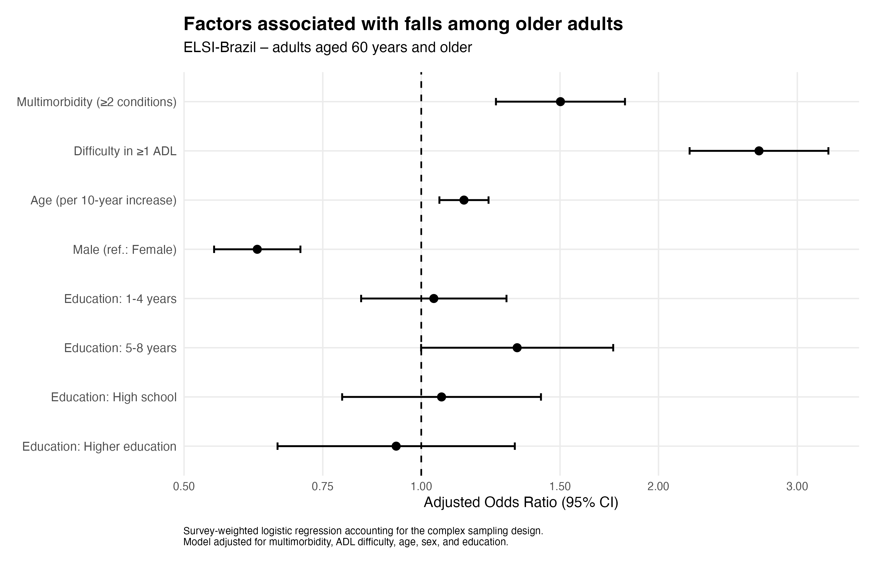

# Factors Associated with Falls Among Older Adults in Brazil

### A Complex Survey Analysis of ELSI-Brazil

This portfolio project presents a biostatistical analysis of data from the third wave of the **Brazilian Longitudinal Study of Aging (ELSI-Brazil)**.

The objective was to investigate factors associated with self-reported falls in the previous 12 months among adults aged 60 years and older, with particular attention to **multimorbidity** and **limitations in activities of daily living (ADL)**.

The analysis accounts for the complex survey design of ELSI-Brazil, including sampling weights, strata, and primary sampling units (PSUs).

---

## Research Question

**Which factors are associated with falls among adults aged 60 years and older participating in ELSI-Brazil?**

The analysis focused on:

- Multimorbidity
- Difficulty in activities of daily living (ADL)
- Age
- Sex
- Education

---

## Dataset

Data were obtained from the **third wave of ELSI-Brazil**.

The original dataset contained:

- **10,773 participants**
- **866 variables**

For this analysis, the sample was restricted to participants aged **60 years and older**, resulting in:

**n = 8,571 participants**

The original ELSI-Brazil dataset is **not distributed in this repository**. Information on data access is available from the official ELSI-Brazil sources.

---

## Outcome

The primary outcome was:

**Self-reported fall in the previous 12 months**

The variable was coded as:

- No
- Yes

Non-informative responses were treated as missing values.

---

## Multimorbidity

Multimorbidity was defined as the presence of **two or more chronic conditions** among the selected condition groups:

- Hypertension
- Diabetes
- Heart disease
- Stroke
- Asthma
- Chronic obstructive pulmonary disease (COPD)
- Arthritis/rheumatism
- Osteoporosis
- Chronic back problems
- Depression

The multimorbidity indicator was calculated among participants with complete information for the selected conditions.

---

## Functional Limitation

Functional limitation was defined as difficulty performing **at least one activity of daily living (ADL)** included in the analysis.

---

## Statistical Analysis

All analyses were performed in **R**.

The complex survey design was specified using:

- Calibrated sampling weights
- Sampling strata
- Primary sampling units (PSUs)

The analytical workflow included:

1. Data import and cleaning
2. Variable recoding
3. Missing-data assessment
4. Construction of multimorbidity and ADL indicators
5. Descriptive statistics
6. Survey-weighted prevalence estimation
7. Survey-adjusted bivariate association tests
8. Survey-weighted logistic regression
9. Adjusted Odds Ratios (OR) with 95% confidence intervals
10. Forest Plot visualization

Main R packages:

- `tidyverse`
- `survey`
- `gtsummary`
- `ggplot2`

---

## Key Results

### Prevalence of Falls

The crude prevalence of falls in the previous 12 months was **20.6%**.

After accounting for the complex survey design, the estimated prevalence was:

**20.9% (95% CI: 18.5–23.2%)**

---

## Multivariable Logistic Regression

The adjusted model included:

- Multimorbidity
- ADL difficulty
- Age
- Sex
- Education

The final model included **8,237 participants**, corresponding to **96.1%** of the eligible analytical sample.

| Factor | Adjusted OR | 95% CI |
|---|---:|---:|
| Multimorbidity (≥2 conditions) | **1.50** | **1.24–1.81** |
| Difficulty in ≥1 ADL | **2.68** | **2.19–3.29** |
| Age (per 10-year increase) | **1.13** | **1.05–1.22** |
| Male vs. Female | **0.62** | **0.55–0.70** |

The overall Wald test for education yielded **p = 0.110**.

After adjustment for the other variables included in the model, multimorbidity, ADL difficulty, age, and sex remained associated with the odds of reporting a fall.

Because this is an observational analysis, these estimates should be interpreted as **associations rather than causal effects**.

---

## Forest Plot

Adjusted Odds Ratios and 95% confidence intervals from the survey-weighted logistic regression model are shown below.

The dashed vertical line at **OR = 1** represents the null value for the Odds Ratio.

---
## Analysis Workflow

The analytical workflow included:

1. Import and preparation of ELSI-Brazil third-wave data
2. Selection of participants aged 60 years and older
3. Recoding and missing-data handling
4. Construction of multimorbidity and ADL indicators
5. Specification of the complex survey design
6. Survey-weighted descriptive analysis
7. Bivariate association testing
8. Survey-weighted logistic regression
9. Estimation of adjusted Odds Ratios and 95% confidence intervals
10. Visualization of the adjusted model using a Forest Plot

The analysis was conducted in **R**, primarily using the `tidyverse`, `survey`, `gtsummary`, and `ggplot2` packages.

> **Portfolio note:** This repository presents the statistical methodology, analytical workflow, and selected outputs as a portfolio case study. Participant-level ELSI-Brazil data and the original working analysis scripts are not distributed in this repository.## Skills Demonstrated

This project demonstrates practical experience with:

- Biostatistics
- Epidemiological data analysis
- R
- Data wrangling
- Health data analysis
- Complex survey data
- Missing-data handling
- Hypothesis testing
- Logistic regression
- Odds Ratios and confidence intervals
- Data visualization
- Reproducible analytical workflows
- Statistical communication

---

## Limitations

This analysis should be interpreted in light of several limitations.

Falls and chronic conditions were based on self-reported information and may therefore be subject to recall or reporting error. The analysis also used complete cases for variables included in the final regression model. Although 96.1% of the eligible analytical sample was retained, missing data may still introduce bias if missingness was systematic.

Finally, the analysis is observational and does not establish causal relationships between the investigated factors and falls.

---

## Purpose

This project was developed as a **biostatistics and health data analysis portfolio project**, demonstrating an end-to-end workflow from raw survey data preparation to statistical modeling and communication of results.
